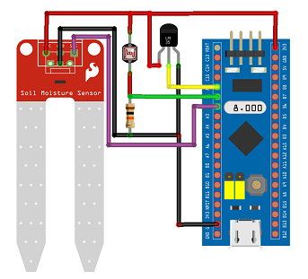

<h1 align=center>Interfacing Analog Sensors</h1>

This code deals with interfacig LM35 Temperature sensor, LDR based Light Intensity Sensor and Soil Moisture Sensor to STM32F103C8-Bluepill Board.

#### WorkFlow

* Interface LM-35 Temperture Sensor to PA0 of STM32F103C8
* Interface LDR to PA1 of STM32F103C8
* Interface Soil Moisture Sensor to PA1 of STM32F103C8
* Use SysTick timer for delay generation
* Use ADC1 to read the sensors using continuous mode
* Store the Sensor data directly into memory using DMA
* Send the Sensor data using UART3

#### Creating New Project in Keil MDK

* Project New uvision project
* Select the device STM32F103C8
* Select CIMSIS under core
* Select Startup under Device
* Add main.c in to the source group

#### Connection Diagram

